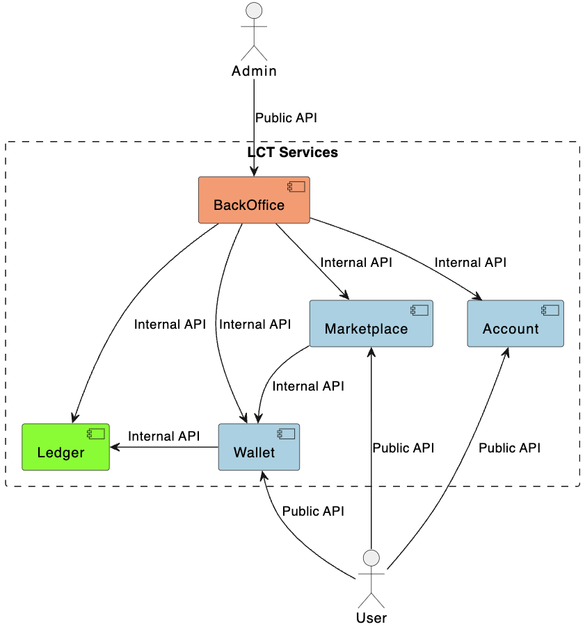
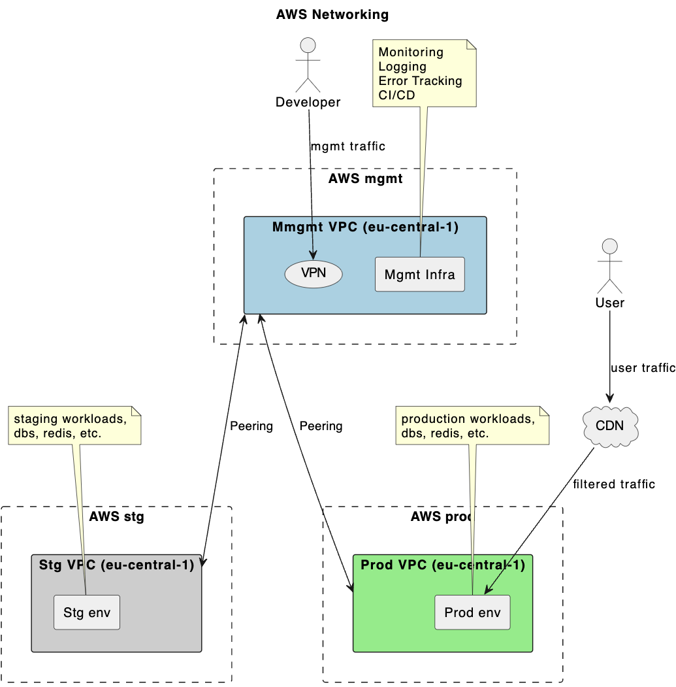
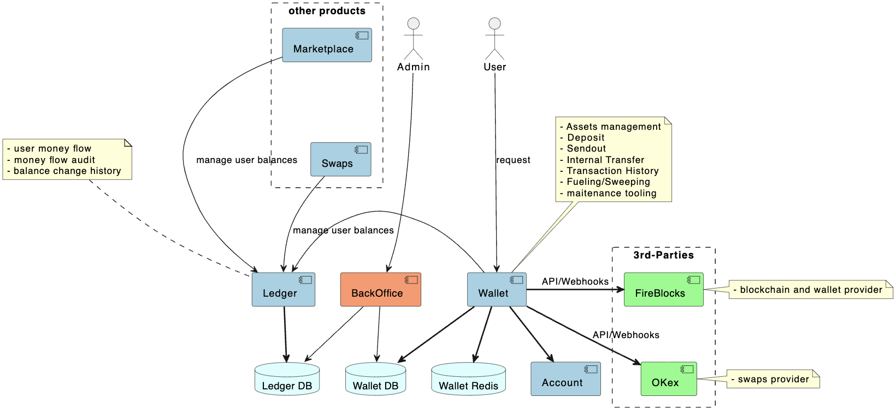
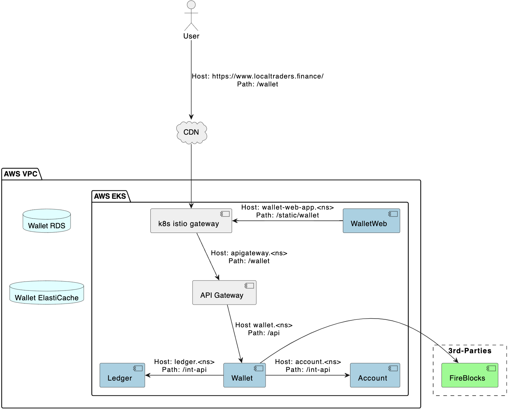
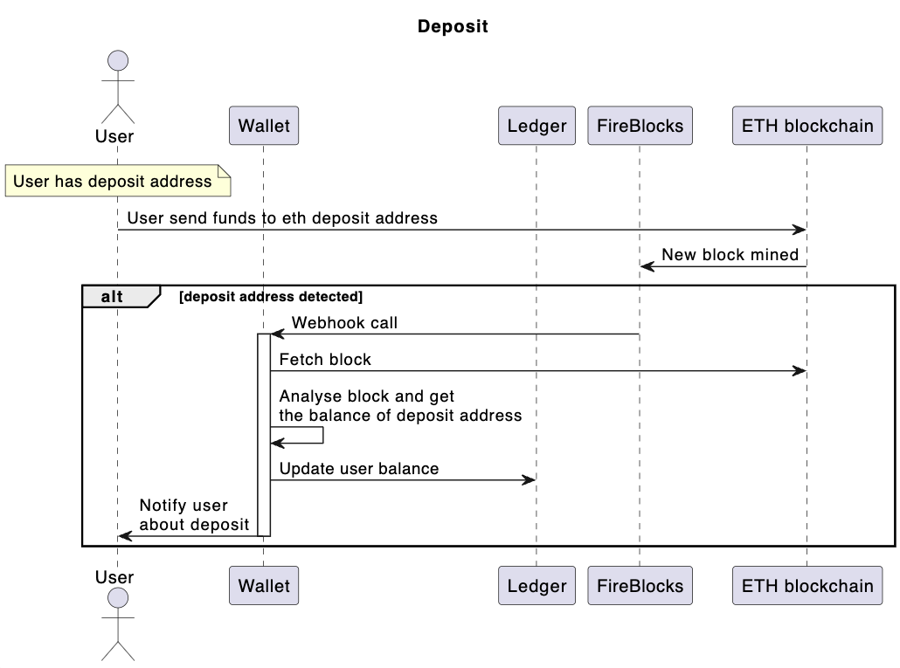
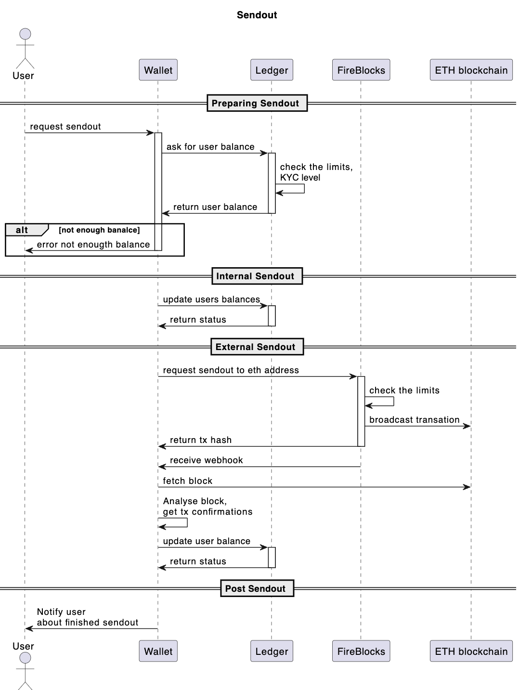
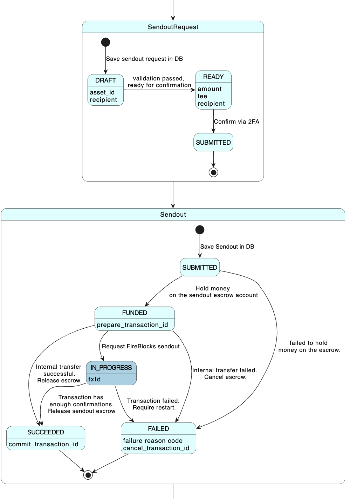
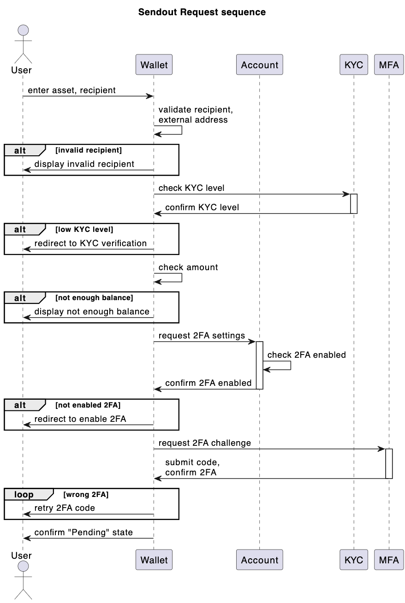

# HLA
1. [Platform Components](platform_components/platform_components.puml)

# Infrastructure
1. [AWS Accounts](aws_accounts/aws_accounts.puml)

2. [AWS Networking](aws_networking/aws_networking.puml)

# Wallet
1. [Wallet Components](wallet_components/wallet_components.puml)

2. [Wallet Assets](wallet_assets/wallet_assets.puml)

3. [Wallet Deployment](wallet_deployment/wallet_deployment.puml)

## Deposit
1. [Deposit Sequence Diagram](deposit_sequence/deposit_sequence.puml)

## Sendout
1. [Sendout Sequence Diagram](sendout_sequence/sendout_sequence.puml)

2. [Sendout LifeCycle Diagram](sendout_lifecycle/sendout_lifecycle.puml)

3. [Sendout Request Sequence Diagram](sendoutrequest_sequence/sendoutrequest_sequence.puml)

