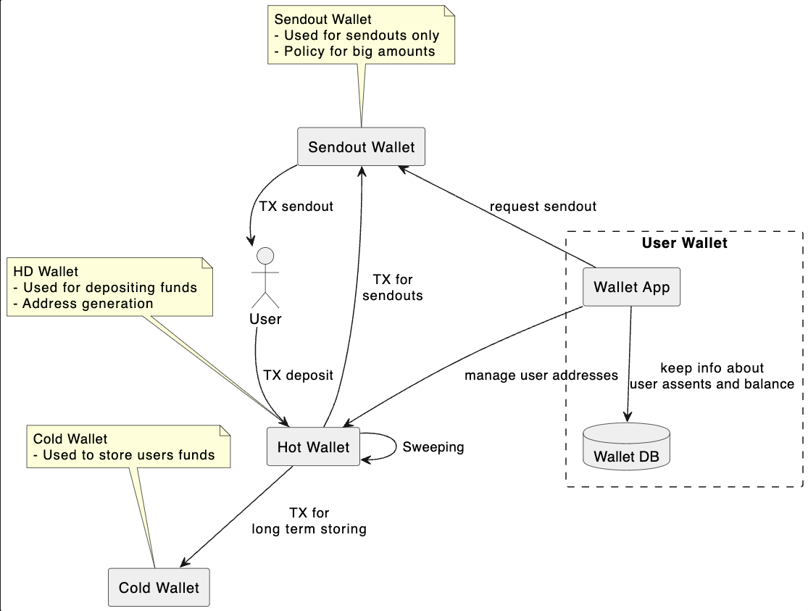
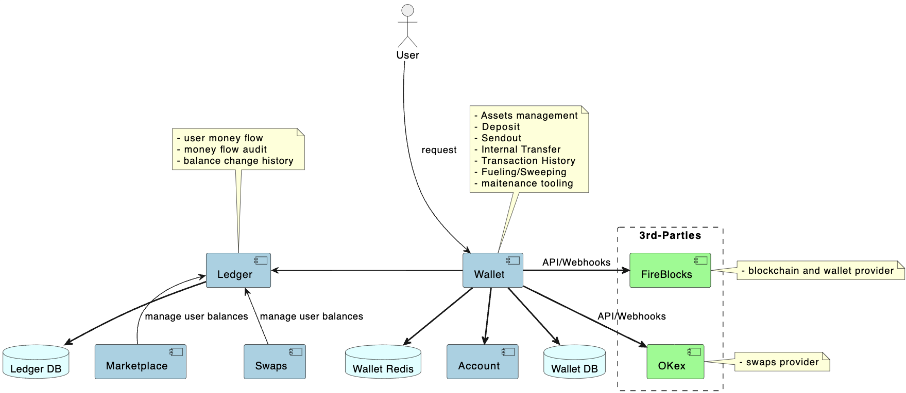

# Sequence Diagrams
1. [Deposit Sequence Diagram](deposit_sequence/deposit_sequence.puml)

2. [Sendout Sequence Diagram](sendout_sequence/sendout_sequence.puml)

3. [Sendout LifeCycle Diagram](sendout_lifecycle/sendout_lifecycle.puml)

4. [Sendout Request Sequence Diagram](sendoutrequest_sequence/sendoutrequest_sequence.puml)

# Component Diagrams
1. [Wallet Components](wallet_components/wallet_components.puml)

2. [Wallet Assets](wallet_assets/wallet_assets.puml)

3. Wallet Requests Flow
3. Wallet signing TX process 
4. ETH Fueling/Sweeping process https://noones.atlassian.net/wiki/spaces/CTO/pages/1901509/Wallet+-+04+Sweeping+and+Fuelling
   https://noones.atlassian.net/wiki/spaces/CTO/pages/1901438/Fuelling+Sweeping+from+Paxful
5. Wallet - 03 Deposit
6.  

# Deployment Diagrams
1. [AWS Accounts](aws_accounts/aws_accounts.puml)

2. [AWS Networking](aws_networking/aws_networking.puml)

3. [Wallet Deployment](wallet_deployment/wallet_deployment.puml)

